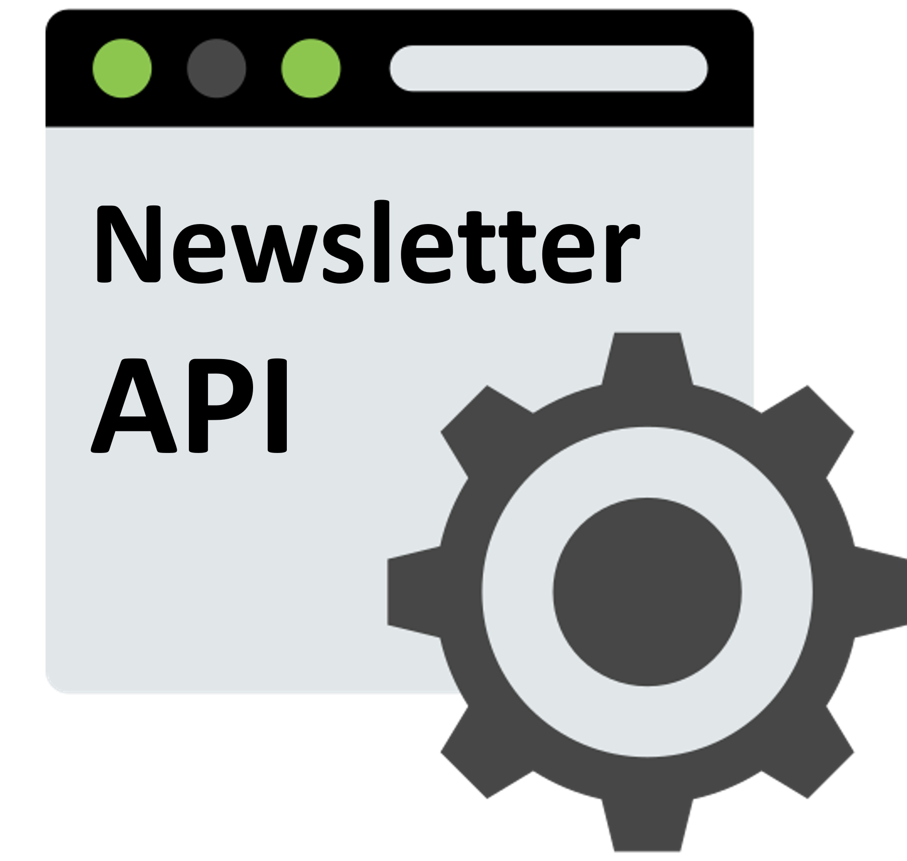

## Newsletter API

<p align="center">
    
    <br />
    <br />
    <a href="https://newsletter-deschamps.herokuapp.com/news">Demo</a>
    ·
    <a href="https://github.com/jjeanjacques10/newsletter-api/issues">Report Bug</a>
    ·
    <a href="https://github.com/jjeanjacques10/newsletter-api/issues">Request Feature</a>
</p>

<p align="center">
   <a href="https://www.linkedin.com/in/jjean-jacques10/">
      
   </a>
  

  <a href="https://github.com/jjeanjacques10/newsletter-api/commits/master">
    
  </a>
  
  
  <a href="https://github.com/jjeanjacques10/newsletter-api/stargazers">
    
  </a>
</p>


API that returns a JSON news list of popular newsletters. Currently, the API only supports one newsletter, but it will be extended to support more than one in the future.

### Technologies

* [TypeScript](https://www.typescriptlang.org/)
* [Node.js](https://nodejs.org/)
* [Express.js](https://expressjs.com/)
* [Redis](https://redis.io/)

## Getting started

### Configuration Newsletter #1

set the following environment variables in `.env`:

``` bash
GOOGLE_SHEET_ID=

PROJECT_ID=
PRIVATE_KEY_ID=
PRIVATE_KEY=
CLIENT_EMAIL=
CLIENT_ID=
CLIENT_X509_CERT_URL=
PRODUCTION=< true | false >

REDIS_URL=
```

### Running the server

``` bash
npm install
npm run dev
```

to run the server in production mode, set the `PRODUCTION` environment variable to `true`

``` bash
npm install
npm run build
npm run start
```

call the following URL to get the list of news:

- GET http://localhost:3000/news

or using heroku deployed app:

- GET https://api-newsletter.herokuapp.com/news


## Newsletters configuted

- #1 Filipe Deschamps Newsletter (https://filipedeschamps.com.br/newsletter)

## Diagram


## Next steps

- [x] Update cache parameter in request to get the latest news
- [ ] Add support for more than one newsletter
- [ ] Return the list of news in a Text plain format
- [ ] Observability and monitoring with Prometheus + Grafana

---
developed by [@jjeanjacques10](https://github.com/jjeanjacques10)