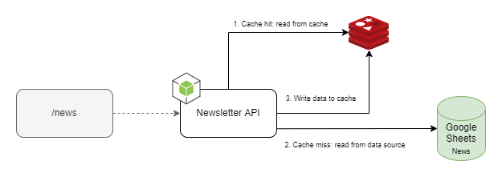

## Newsletter API

<p align="center">
    
    <br />
    <br />
    <a href="https://www.amazon.com.br/Jean-Jacques-Barros-Newsletter-Deschamps/dp/B08RG61BPD">Ver Demo</a>
    ·
    <a href="https://github.com/jjeanjacques10/newsletter-api/issues">Reportar Bug</a>
    ·
    <a href="https://github.com/jjeanjacques10/newsletter-api/issues">Solicitar Feature</a>
</p>


API to return a list of news from a newslletter. Currently, the API only supports one newsletter, but it will be extended to support more than one in the future.

### Technologies

* [TypeScript](https://www.typescriptlang.org/)
* [Node.js](https://nodejs.org/)
* [Express.js](https://expressjs.com/)


## Getting started

### Configuration Newslletter #1

set the following environment variables in `.env`:

``` bash
GOOGLE_SHEET_ID=

PROJECT_ID=
PRIVATE_KEY_ID=
PRIVATE_KEY=
CLIENT_EMAIL=
CLIENT_ID=
CLIENT_X509_CERT_URL=
```

### Running the server

``` bash
npm run dev
```

call the following URL to get the list of news:

- GET http://localhost:3000/news

or using heroku deployed app:

- GET https://newsletter-deschamps.herokuapp.com/news


## Newsletters configuted

- [#1] Filipe Deschamps Newsletter (https://filipedeschamps.com.br/newsletter)

---
developed by [@jjeanjacques10](https://github.com/jjeanjacques10)